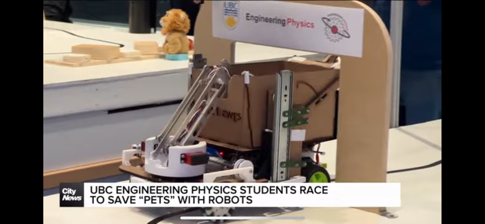

# Taichi Kamei
Engineering Physics student at UBC  

Welcome to my portfolio!  
I’m interested in robotics, PCB design, and sustainable product development.

## Featured Projects
- [Pet Detection Robot](project1.md)

